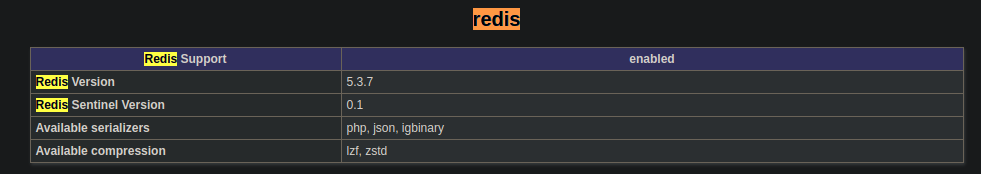

# easy-shopee


## Installing
使用之前，请阅读Shopee开发文档V2
https://open.shopee.com/developer-guide/4


```shell
$ composer require onetech/easy-shopee -vvv
```

## Usage

```php
<?php

use Onetech\EasyShopee\Exception\ShopeeException;
use Onetech\EasyShopee\Shopee;

require '../vendor/autoload.php';

$redis = new Redis();
$redis->connect('redis',6379,1);
$redis->auth('secret');

$cache = new \Doctrine\Common\Cache\RedisCache();
$cache->setRedis($redis);

$shopee = new Shopee([
    'app_key' => 'Your Test Partner_id',//int
    'app_secret' => 'Your Test Key',//string
    'debug' => app()->isDebug(),
    'sandbox' => false,
    'log' => [
        'name' => 'Shopee',
        'file' => sys_get_temp_dir() . '/Shopee.log',
        'level' => 'debug',
        'permission' => 0777,
    ],
    'cache' => $cache
]);

```

### 关于cache

```code
使用file
$cache = new Doctrine\Common\Cache\FilesystemCache(sys_get_temp_dir());

使用redis
$redis = new Redis();
$redis->connect('redis',6379,1);
$redis->auth('secret');

$cache = new \Doctrine\Common\Cache\RedisCache();
$cache->setRedis($redis);

```
注意，使用redis作为cache时，Available serializers 需要开启 igbinary序列器

